# 义务教育优质均衡督导系统 - 页面与对话框汇总

> 本文档包含系统所有页面和对话框的详细说明，以及对应的页面截图。
> 截图位于 `docs/screenshots/` 目录下，按角色分类存放。

## 一、系统角色定义

| 角色代码           | 角色名称     | 主要职责                         | 权限代码                                    |
| ------------------ | ------------ | -------------------------------- | ------------------------------------------- |
| `admin`          | 系统管理员   | 系统配置、用户管理、项目全局配置 | `canManageSystem` (所有权限)              |
| `project_admin`  | 项目管理员   | 项目配置、人员管理、进度查看     | `canManageProjects`, `canConfigProject` |
| `data_collector` | 数据采集员   | 数据填报和采集                   | `canCollectData`                          |
| `project_expert` | 项目评估专家 | 数据审核和评估                   | `canReviewData`                           |
| `decision_maker` | 报告决策者   | 查看评估报告和决策               | `canViewReports`                          |

### 权限映射关系

```
canManageSystem: admin only              # 系统管理权限
canManageProjects: admin || project_admin # 项目管理权限
canCollectData: admin || data_collector   # 数据填报权限
canReviewData: admin || project_expert    # 数据审核权限
canViewReports: admin || decision_maker   # 查看报告权限
canConfigProject: admin || project_admin  # 项目配置权限
```

---

## 二、按角色分类的页面汇总

### 1. 系统管理员 (admin) - 全部权限

#### 系统管理页面

| 页面名称     | 路径                      | 组件文件                              | 功能               | 核心要素                           |
| ------------ | ------------------------- | ------------------------------------- | ------------------ | ---------------------------------- |
|              |                           |                                       |                    |                                    |
| 学校账号管理 | `/users/school-account` | `UserManagement/index.tsx`          | 管理学校填报员账号 | 手机号、姓名、密码、重置密码       |
| 专家账号管理 | `/users/expert-account` | `ExpertAccountManagement/index.tsx` | 管理专家账号       | 手机号、姓名、组织、专业领域、状态 |

#### 页面截图

| 页面         | 截图                                                 |
| ------------ | ---------------------------------------------------- |
|              |                                                      |
|              |                                                      |
| 学校账号管理 |  |
| 专家账号管理 | 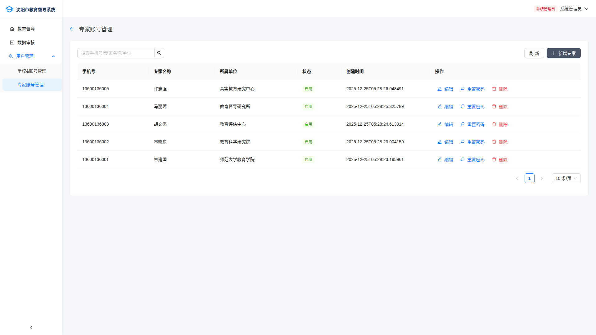 |

---

### 2. 项目管理员 (project_admin)

#### 首页与项目列表

| 页面名称 | 路径               | 组件文件              | 功能                 | 核心要素                              |
| -------- | ------------------ | --------------------- | -------------------- | ------------------------------------- |
| 系统首页 | `/home`          | `Home/index.tsx`    | 显示可用督导模块入口 | 义务教育优质均衡模块卡片              |
| 项目列表 | `/home/balanced` | `Project/index.tsx` | 项目管理             | 项目卡片、状态Tag、发布/配置/删除操作 |

#### 库管理页面

| 页面名称   | 路径                          | 组件文件                        | 功能             | 核心要素                                 |
| ---------- | ----------------------------- | ------------------------------- | ---------------- | ---------------------------------------- |
| 要素库     | `/home/balanced/elements`   | `ElementLibrary/index.tsx`    | 管理评估基本要素 | 要素列表、搜索过滤、创建/编辑、发布/下线 |
| 指标体系库 | `/home/balanced/indicators` | `IndicatorLibrary/index.tsx`  | 管理评估指标体系 | 指标卡片、状态统计、发布/编辑中过滤      |
| 指标编辑   | `…/indicators/:id/edit`    | `IndicatorEdit/index.tsx`     | 编辑指标详情     | 基本信息、权重、评分设置、附件上传       |
| 指标树编辑 | `…/indicators/:id/tree`    | `IndicatorTreeEdit/index.tsx` | 编辑指标层级结构 | 树形结构、添加/删除子指标、拖拽排序      |
| 工具库     | `/home/balanced/tools`      | `ToolLibrary/index.tsx`       | 管理数据采集工具 | 工具卡片、创建/编辑、问卷链接弹窗        |
| 工具编辑   | `…/tools/:id/edit`         | `FormToolEdit/index.tsx`      | 可视化表单设计   | 字段编辑、拖拽排序、属性设置、条件逻辑   |

#### 项目配置页面

| 页面名称               | 路径                                       | 组件文件                             | 功能                   | 核心要素                |
| ---------------------- | ------------------------------------------ | ------------------------------------ | ---------------------- | ----------------------- |
| **项目配置中心** | `…/project/:projectId/config`           | `ProjectConfig/index.tsx`          | 项目配置入口（9个Tab） | 见下方Tab详情           |
| 项目指标体系           | `…/project/:projectId/indicator-system` | `ProjectIndicatorSystem/index.tsx` | 配置项目指标体系       | 指标树、权重设置        |
| 项目要素               | `…/project/:projectId/elements`         | `ProjectElements/index.tsx`        | 配置项目评估要素       | 指标-要素关联、拖拽关联 |
|                        |                                            |                                      |                        |                         |

**项目配置中心Tab组件:**

| Tab名称  | 组件文件                    | 功能              | 核心要素                         |
| -------- | --------------------------- | ----------------- | -------------------------------- |
| 评估对象 | `SubmissionSchoolTab.tsx` | 配置评估学校/区县 | 添加/删除学校、批量导入          |
| 人员账号 | `PersonnelTab.tsx`        | 配置项目参与人员  | 添加管理员/采集员/专家、批量导入 |
|          |                             |                   |                                  |
| 指标配置 | `IndicatorTab.tsx`        | 指标权重配置      | 权重设置、约束条件               |
|          |                             |                   |                                  |
| 任务分配 | `TaskAssignmentTab.tsx`   | 填报任务分配      | 分配人员填报任务                 |
| 专家评估 | `ExpertEvaluationTab.tsx` | 专家评估配置      | 分配评估专家和任务               |
|          |                             |                   |                                  |
| 进度总览 | `ProgressOverview.tsx`    | 项目进度统览      | 各配置阶段完成度                 |

#### 项目数据查看

| 页面名称 | 路径                                           | 组件文件                               | 功能             | 核心要素                        |
| -------- | ---------------------------------------------- | -------------------------------------- | ---------------- | ------------------------------- |
| 区县列表 | `…/project/:projectId/detail`               | `ProjectDetail/DistrictListPage.tsx` | 查看项目下区县   | 区县卡片、统计信息、进度条      |
| 项目详情 | `…/project/:projectId/district/:districtId` | `ProjectDetail/index.tsx`            | 查看区县学校数据 | 学校表格、指标数据、提交进度    |
| 数据审核 | `/data-review`                               | `DataReview/index.tsx`               | 审核项目数据     | 统计卡、项目/状态过滤、驳回弹窗 |
| 简历分析 | `…/project/:projectId/cv-analysis`          | `CVAnalysis/index.tsx`               | 数据CV分析       | 数据表格、统计图表              |
| 合规统计 | `…/project/:projectId/compliance`           | `ComplianceStats/index.tsx`          | 合规性统计       | 合规率、不合规原因分析          |
| 评估总结 | `…/project/:projectId/evaluation-summary`   | `EvaluationSummary/index.tsx`        | 评估报告生成     | 指标统计、学校排名、导出        |

#### 页面截图

| 页面       | 截图                                                          |
| ---------- | ------------------------------------------------------------- |
| 系统首页   | 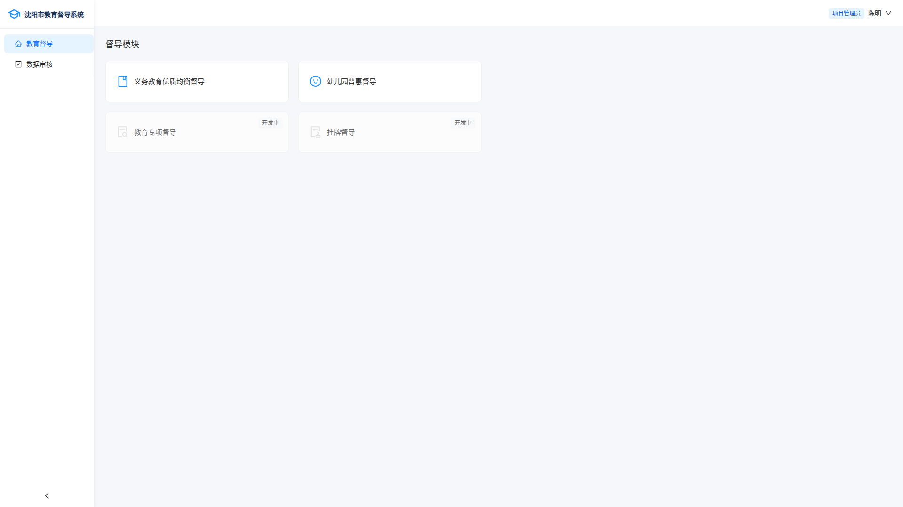          |
| 项目列表   | 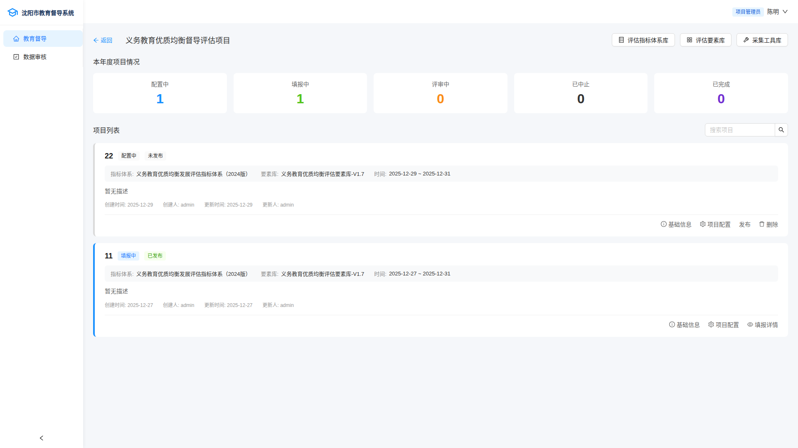 |
| 要素库     | 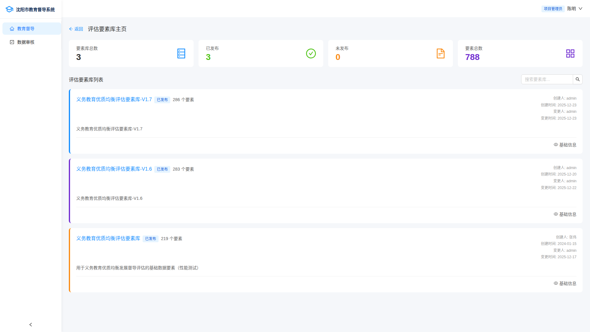              |
| 指标体系库 |       |
| 工具库     |               |
| 数据审核   | 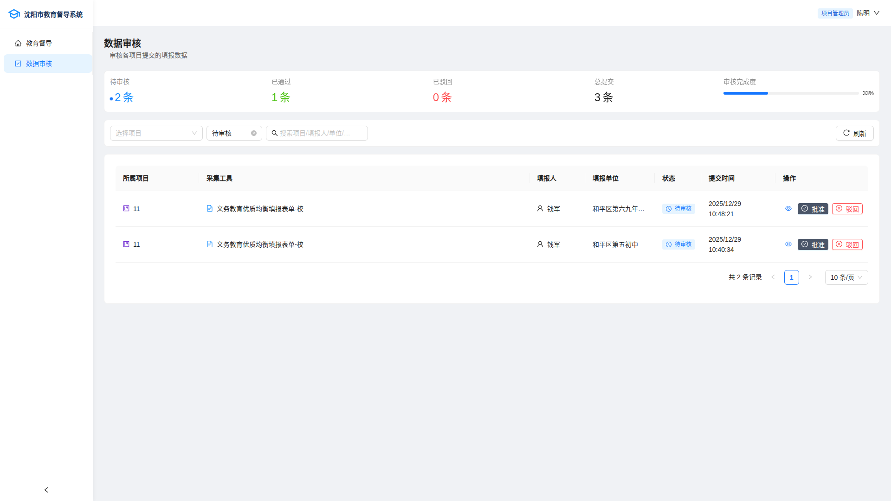          |

---

### 3. 数据采集员 (data_collector)

| 页面名称     | 路径                                 | 组件文件                         | 功能           | 核心要素                           |
| ------------ | ------------------------------------ | -------------------------------- | -------------- | ---------------------------------- |
| 采集员工作台 | `/collector`                       | `CollectorDashboard/index.tsx` | 项目和任务列表 | 项目卡片、任务统计、状态过滤       |
| 任务列表     | `/collector/:projectId`            | `CollectorDashboard/index.tsx` | 查看分配任务   | 任务表格、任务统计卡、指标查看     |
| 数据填报首页 | `/home/balanced/entry`             | `DataEntry/index.tsx`          | 选择项目和工具 | 项目选择、工具列表、提交状态统计   |
| 表单填报     | `…/entry/:projectId/form/:formId` | `DataEntryForm/index.tsx`      | 动态表单填报   | 动态字段、草稿保存、提交、附件上传 |
| 问题整改     | `/rectification`                   | `IssueRectification/index.tsx` | 查看整改问题   | 问题统计、问题列表、整改提交       |

#### 页面截图

| 页面         | 截图                                                          |
| ------------ | ------------------------------------------------------------- |
| 采集员工作台 | 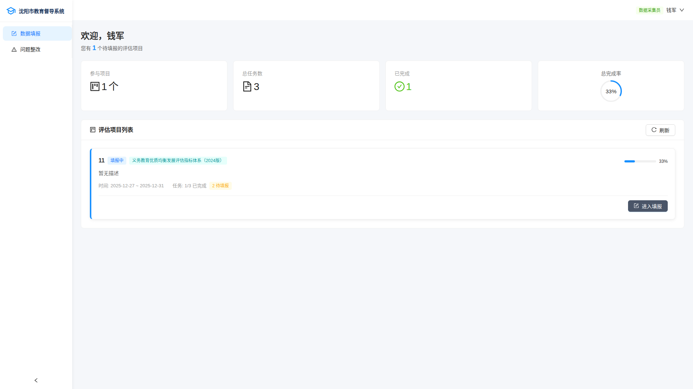 |
| 问题整改     | 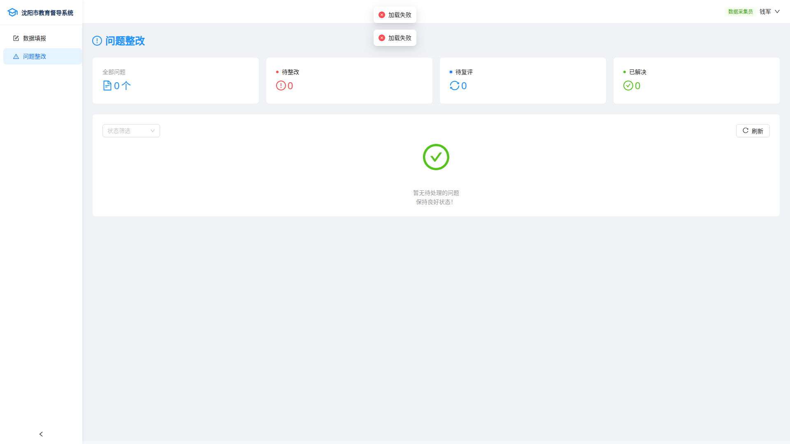         |

---

### 4. 项目评估专家 (project_expert)

| 页面名称     | 路径                                                  | 组件文件                                  | 功能           | 核心要素                         |
| ------------ | ----------------------------------------------------- | ----------------------------------------- | -------------- | -------------------------------- |
| 专家工作台   | `/expert`                                           | `ExpertDashboard/index.tsx`             | 项目列表       | 欢迎区域、项目统计卡、项目列表   |
| 项目评估详情 | `/expert/projects/:projectId`                       | `ExpertProjectDetail/index.tsx`         | 区县评估情况   | 审核概览、区县指标、提交列表     |
| 区县评估详情 | `/expert/projects/:projectId/districts/:districtId` | `ExpertDistrictDetail/index.tsx`        | 学校评估数据   | 学校列表、指标数据、评分按钮     |
| 评估任务列表 | `/expert/evaluations`                               | `ExpertEvaluation/index.tsx`            | 分配的评估任务 | 任务统计、任务表格、状态过滤     |
| 评估详情     | `/expert/evaluations/:evaluationId`                 | `ExpertEvaluation/EvaluationDetail.tsx` | 进行评估工作   | 指标列表、评分输入、评论、附件   |
| 待审核列表   | `/expert/pending-reviews`                           | `ExpertEvaluation/PendingReviews.tsx`   | 待审核评估结果 | 提交列表、审核按钮、审核意见弹窗 |

#### 页面截图

| 页面         | 截图                                                          |
| ------------ | ------------------------------------------------------------- |
| 专家工作台   | 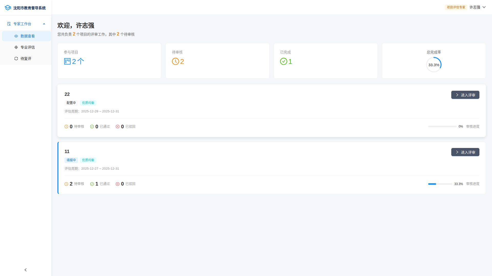     |
| 评估任务列表 |  |
| 待审核列表   | 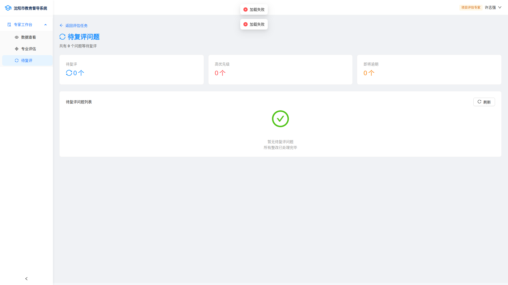     |

---

### 5. 报告决策者 (decision_maker)

| 页面名称 | 路径                    | 组件文件                         | 功能             | 核心要素                           |
| -------- | ----------------------- | -------------------------------- | ---------------- | ---------------------------------- |
| 报告列表 | `/reports`            | `Reports/index.tsx`            | 报告查看入口     | 统计卡、报告卡片、类型/状态过滤    |
| 项目报告 | `/reports/:projectId` | `Reports/Detail/index.tsx`     | 项目完整评估报告 | 项目信息、评估结果、排名表格、导出 |
| 统计报告 | `/reports/statistics` | `Reports/Statistics/index.tsx` | 全局数据统计     | 柱状图/折线图、达标率统计          |
| 排名报告 | `/reports/rankings`   | `Reports/Rankings/index.tsx`   | 学校和区县排名   | 排名表格、分段统计                 |
| 预警报告 | `/reports/alerts`     | `Reports/Alerts/index.tsx`     | 需关注的数据     | 预警列表、原因分类、风险指数       |
| 对比报告 | `/reports/comparison` | `Reports/Comparison/index.tsx` | 对比分析         | 对象选择、对比图表、数据表格       |

#### 页面截图

| 页面     | 截图                                                  |
| -------- | ----------------------------------------------------- |
| 报告列表 | 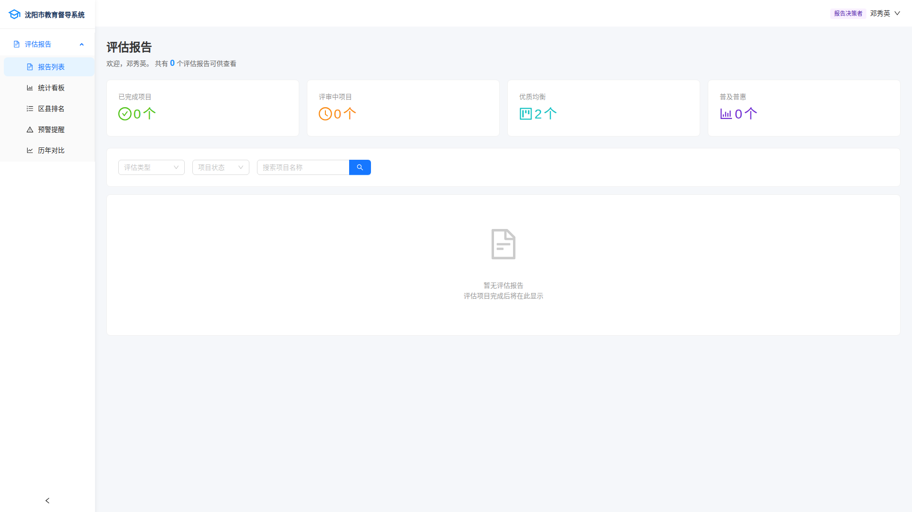 |
| 统计报告 | 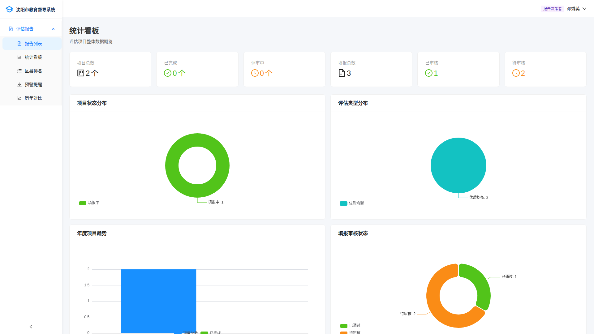 |
| 排名报告 | 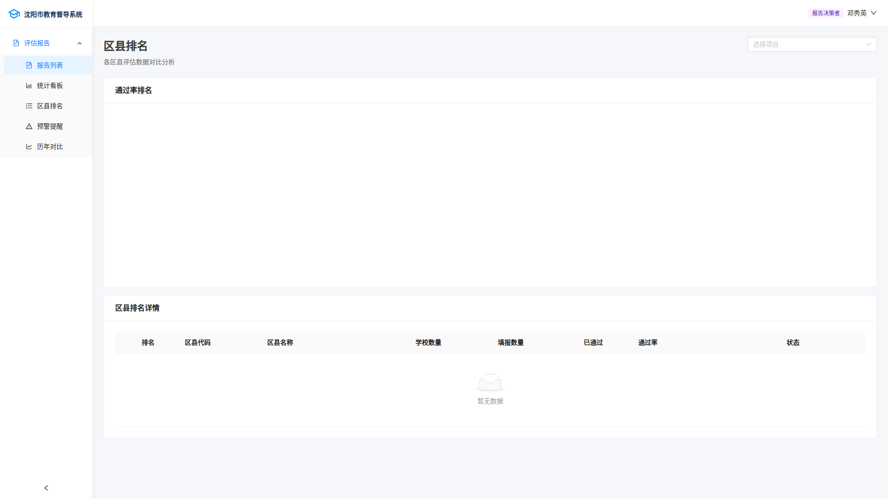 |
| 预警报告 | 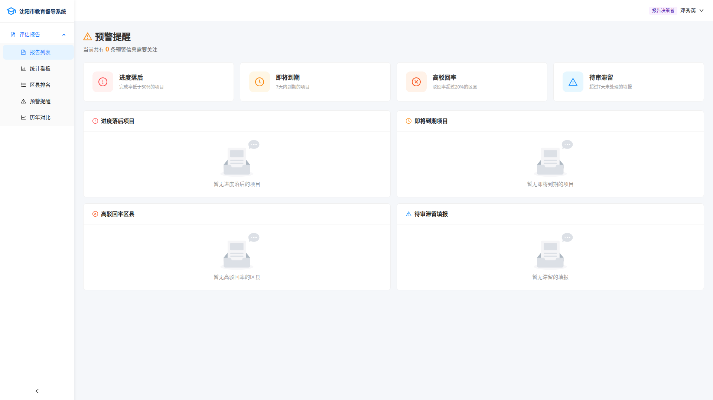 |
| 对比报告 | 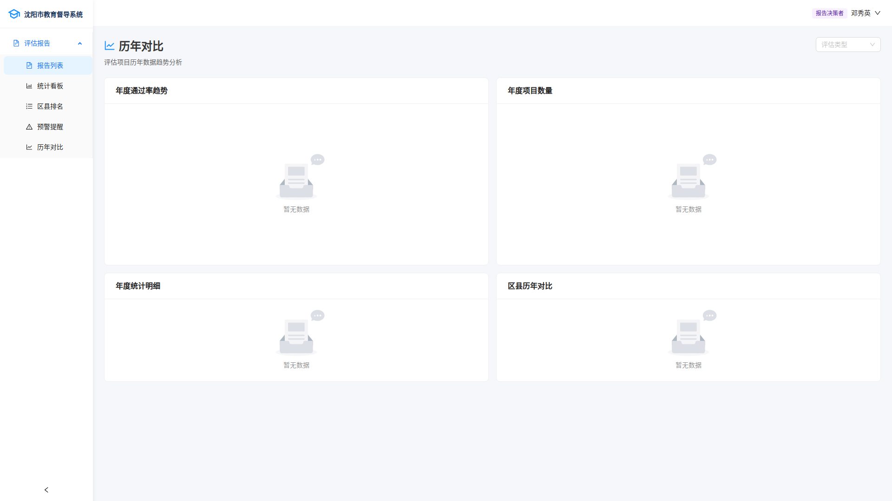 |

---

### 6. 通用页面（所有角色）

| 页面名称 | 路径                | 组件文件                       | 功能         | 核心要素                   |
| -------- | ------------------- | ------------------------------ | ------------ | -------------------------- |
| 登录页   | `/login`          | `Login/index.tsx`            | 用户登录     | 手机号、密码、角色快速选择 |
| 填报详情 | `/data-entry/:id` | `SubmissionDetail/index.tsx` | 查看提交记录 | 自动跳转到表单页           |

#### 页面截图

| 页面   | 截图                                      |
| ------ | ----------------------------------------- |
| 登录页 | 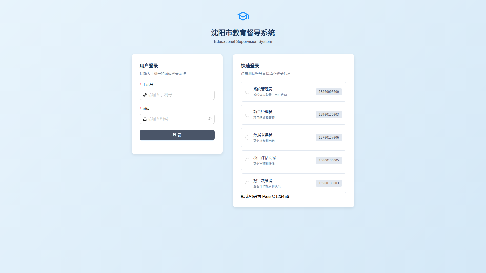 |

---

## 三、对话框/模态框汇总

### 1. 人员管理相关

| 对话框名称      | 组件位置                                | 功能         | 核心字段                                                 |
| --------------- | --------------------------------------- | ------------ | -------------------------------------------------------- |
| AddPersonModal  | `ProjectConfig/components/Modals.tsx` | 添加项目人员 | 用户选择(支持搜索)、角色(Select)、组织、区县(采集员专用) |
| ImportModal     | `ProjectConfig/components/Modals.tsx` | 批量导入人员 | 文件上传、数据预览表格、冲突处理(名称/身份证/手机)       |
| MorePersonModal | `ProjectConfig/components/Modals.tsx` | 批量操作人员 | 人员列表表格、选择操作                                   |

### 3. 评估对象(学校)配置相关

| 对话框名称                  | 组件位置                                | 功能             | 核心字段                                         |
| --------------------------- | --------------------------------------- | ---------------- | ------------------------------------------------ |
| AddSubmissionDistrictModal  | `ProjectConfig/components/Modals.tsx` | 添加评估区县     | 区县选择(Select)                                 |
| AddSubmissionSchoolModal    | `ProjectConfig/components/Modals.tsx` | 添加评估学校     | 所属区县选择、学校选择、学校搜索                 |
| ImportSubmissionSchoolModal | `ProjectConfig/components/Modals.tsx` | 批量导入评估学校 | Excel文件上传、模板下载、导入进度条、导入结果    |
| SelectSchoolModal           | `ProjectConfig/components/Modals.tsx` | 学校选择         | 学校搜索框、学校类型过滤、学校列表、已选学校显示 |
| CreateSchoolModal           | `ProjectConfig/components/Modals.tsx` | 创建新学校       | 学校代码、学校名称、学校类型、区县选择           |

### 4. 查看详情相关

| 对话框名称           | 组件位置                                                  | 功能         | 核心字段                                     |
| -------------------- | --------------------------------------------------------- | ------------ | -------------------------------------------- |
| IndicatorDetailModal | `DistrictDashboard/components/IndicatorDetailModal.tsx` | 查看指标详情 | 指标名称、指标说明、指标权重、达标线、数据值 |
| SchoolDetailModal    | `DistrictDashboard/components/SchoolDetailModal.tsx`    | 查看学校详情 | 学校名称、学校代码、学校类型、指标数据表格   |
| SurveyLinkModal      | `ToolLibrary/SurveyLinkModal.tsx`                       | 问卷链接     | 问卷链接显示、复制链接按钮、二维码展示       |

### 5. 抽屉组件

| 抽屉名称                 | 组件位置                                                  | 功能         | 核心内容                                              |
| ------------------------ | --------------------------------------------------------- | ------------ | ----------------------------------------------------- |
| ElementAssociationDrawer | `ProjectConfig/components/ElementAssociationDrawer.tsx` | 要素关联配置 | 指标显示、可用要素列表、已关联要素列表、添加/删除按钮 |

---

## 四、测试账号

| 角色         | 手机号      | 密码        | 默认入口       |
| ------------ | ----------- | ----------- | -------------- |
| 系统管理员   | 13800000000 | 000000      | `/home`      |
| 项目管理员   | 13900139003 | Pass@123456 | `/home`      |
| 数据采集员   | 13700137006 | Pass@123456 | `/collector` |
| 项目评估专家 | 13600136005 | Pass@123456 | `/expert`    |
| 报告决策者   | 13500135003 | Pass@123456 | `/reports`   |

---

## 五、业务流程概览

本系统专注于 **义务教育优质均衡** 督导评估，完整业务流程分为两大阶段：

### 阶段一：基础库建设（一次性配置）

```
┌──────────────────────────────────────────────────────────────────────────────┐
│                           基础库建设（项目管理员）                              │
├──────────────────────────────────────────────────────────────────────────────┤
│                                                                              │
│  ┌─────────────┐    ┌─────────────┐    ┌─────────────┐                      │
│  │  指标体系库  │    │   要素库     │    │ 采集工具库  │                      │
│  │             │    │             │    │             │                      │
│  │ • 创建指标   │    │ • 创建要素   │    │ • 创建表单   │                      │
│  │ • 构建指标树 │    │ • 定义属性   │    │ • 设计字段   │                      │
│  │ • 设置权重   │    │ • 发布要素   │    │ • 配置逻辑   │                      │
│  │ • 发布指标   │    │             │    │ • 发布工具   │                      │
│  └─────────────┘    └─────────────┘    └─────────────┘                      │
│                                                                              │
└──────────────────────────────────────────────────────────────────────────────┘
```

**1. 指标体系库** (`/home/balanced/indicators`)
- 创建评估指标体系（如：资源配置、政府保障、教育质量等一级指标）
- 构建指标树结构（一级指标 → 二级指标 → 三级指标）
- 设置各级指标的权重、达标线、评分规则
- 发布指标体系供项目使用

**2. 要素库** (`/home/balanced/elements`)
- 创建评估要素（如：生均教学仪器设备值、师生比等具体指标）
- 定义要素的数据类型、计算公式、数据来源
- 建立要素与指标的关联关系
- 发布要素供项目使用

**3. 采集工具库** (`/home/balanced/tools`)
- 创建数据采集表单（如：学校基本信息表、教师信息表、设备清单等）
- 设计表单字段（文本、数字、选择、文件上传等）
- 配置字段验证规则和条件逻辑
- 发布采集工具供项目使用

---

### 阶段二：项目执行流程（每个督导项目循环）

```
┌────────────────────────────────────────────────────────────────────────────────────────────┐
│                                    项目执行流程                                              │
├────────────────────────────────────────────────────────────────────────────────────────────┤
│                                                                                            │
│  ┌─────────┐   ┌─────────┐   ┌─────────┐   ┌─────────┐   ┌─────────┐   ┌─────────┐       │
│  │ 1.创建  │ → │ 2.配置  │ → │ 3.填报  │ → │ 4.评估  │ → │ 5.审核  │ → │ 6.报告  │       │
│  │  项目   │   │  项目   │   │  数据   │   │  打分   │   │  验收   │   │  生成   │       │
│  └─────────┘   └─────────┘   └─────────┘   └─────────┘   └─────────┘   └─────────┘       │
│       │             │             │             │             │             │             │
│       ↓             ↓             ↓             ↓             ↓             ↓             │
│   项目管理员    项目管理员     数据采集员     评估专家     项目管理员     报告决策者       │
│                                                                                            │
└────────────────────────────────────────────────────────────────────────────────────────────┘
```

#### 步骤1：创建项目（项目管理员）

**页面**: `/home/balanced` - 项目列表

操作内容：
- 创建新的督导评估项目
- 设置项目名称、评估周期、开始/结束时间
- 选择使用的指标体系（从指标体系库）
- 选择使用的要素库（从要素库）
- 选择使用的采集工具（从采集工具库）

---

#### 步骤2：配置项目（项目管理员）

**页面**: `…/project/:projectId/config` - 项目配置中心

**2.1 评估对象配置** (SubmissionSchoolTab)
- 添加参评区县
- 添加参评学校（支持批量导入）
- 设置学校分类（城区/镇区/乡村）

**2.2 人员账号配置** (PersonnelTab)
- 添加数据采集员（分配到具体区县/学校）
- 添加评估专家（分配评估任务）
- 添加项目管理员（协助管理）
- 支持批量导入人员

**2.3 指标配置** (IndicatorTab)
- 调整项目指标权重（可覆盖库默认值）
- 设置达标线和约束条件
- 配置指标与要素的关联

**2.4 任务分配** (TaskAssignmentTab)
- 为采集员分配填报任务
- 设置填报截止时间
- 分配学校到具体采集员

**2.5 专家评估配置** (ExpertEvaluationTab)
- 分配专家到具体区县/学校
- 设置评估时间安排
- 配置评估维度

**2.6 发布项目**
- 确认所有配置完成
- 发布项目，通知相关人员开始工作

---

#### 步骤3：数据填报（数据采集员）

**页面**: `/collector` - 采集员工作台

**3.1 查看任务**
- 登录系统，进入采集员工作台
- 查看分配的填报任务列表
- 了解任务要求和截止时间

**3.2 填报数据** (`…/entry/:projectId/form/:formId`)
- 选择学校和采集工具
- 填写表单数据（支持草稿保存）
- 上传佐证材料（图片、文件）
- 提交数据等待审核

**3.3 问题整改** (`/rectification`)
- 查看被驳回的数据
- 根据审核意见修改数据
- 重新提交

---

#### 步骤4：专家评估（评估专家）

**页面**: `/expert` - 专家工作台

**4.1 查看评估任务** (`/expert/evaluations`)
- 登录系统，进入专家工作台
- 查看分配的评估任务
- 了解评估学校和指标

**4.2 进行评估** (`/expert/projects/:projectId`)
- 查看学校提交的数据
- 按指标逐项打分
- 填写评估意见和建议
- 上传评估佐证材料

**4.3 区县汇总** (`/expert/projects/:projectId/districts/:districtId`)
- 查看区县整体情况
- 汇总各学校评估结果
- 生成区县评估报告

---

#### 步骤5：数据审核（项目管理员）

**页面**: `/data-review` - 数据审核

**5.1 审核填报数据**
- 查看各学校提交的数据
- 验证数据准确性和完整性
- 批准或驳回数据

**5.2 审核评估结果**
- 查看专家评估结果
- 验证评分合理性
- 确认最终评估结果

**5.3 合规检查** (`…/project/:projectId/compliance`)
- 检查数据合规性
- 识别异常数据
- 生成合规报告

---

#### 步骤6：报告生成（报告决策者）

**页面**: `/reports` - 报告模块

**6.1 统计报告** (`/reports/statistics`)
- 查看整体评估统计
- 分析达标率分布
- 生成统计图表

**6.2 排名报告** (`/reports/rankings`)
- 查看学校/区县排名
- 分析优秀案例
- 识别薄弱环节

**6.3 预警报告** (`/reports/alerts`)
- 识别未达标学校
- 分析问题原因
- 生成整改建议

**6.4 对比报告** (`/reports/comparison`)
- 多学校/区县对比分析
- 历史数据对比
- 生成对比图表

**6.5 项目报告** (`/reports/:projectId`)
- 生成完整项目评估报告
- 导出报告文档
- 存档项目数据

---

### 完整流程图

```
                                    ┌──────────────────┐
                                    │    基础库建设     │
                                    │   （一次性配置）   │
                                    └────────┬─────────┘
                                             │
              ┌──────────────────────────────┼──────────────────────────────┐
              │                              │                              │
              ▼                              ▼                              ▼
     ┌────────────────┐           ┌────────────────┐           ┌────────────────┐
     │   指标体系库    │           │     要素库      │           │   采集工具库    │
     │                │           │                │           │                │
     │ 定义评估标准    │           │ 定义数据要素    │           │ 定义采集表单    │
     └────────┬───────┘           └────────┬───────┘           └────────┬───────┘
              │                              │                              │
              └──────────────────────────────┼──────────────────────────────┘
                                             │
                                             ▼
                                    ┌──────────────────┐
                                    │    创建项目       │
                                    │  选择库资源       │
                                    └────────┬─────────┘
                                             │
                                             ▼
                                    ┌──────────────────┐
                                    │    配置项目       │
                                    │ 学校/人员/任务    │
                                    └────────┬─────────┘
                                             │
                                             ▼
                                    ┌──────────────────┐
                                    │    发布项目       │
                                    └────────┬─────────┘
                                             │
              ┌──────────────────────────────┼──────────────────────────────┐
              │                              │                              │
              ▼                              ▼                              ▼
     ┌────────────────┐           ┌────────────────┐           ┌────────────────┐
     │   数据填报      │           │   专家评估      │           │   数据审核      │
     │   (采集员)      │  ──────▶  │   (专家)        │  ──────▶  │  (项目管理员)   │
     └────────────────┘           └────────────────┘           └────────────────┘
                                             │
                                             ▼
                                    ┌──────────────────┐
                                    │    报告生成       │
                                    │   (决策者)        │
                                    └────────┬─────────┘
                                             │
                                             ▼
                                    ┌──────────────────┐
                                    │    项目归档       │
                                    │   评估完成        │
                                    └──────────────────┘
```

---

### 各角色工作职责汇总

| 角色 | 阶段 | 主要工作 | 相关页面 |
|------|------|---------|---------|
| 项目管理员 | 基础库建设 | 创建指标体系、要素、采集工具 | 指标库、要素库、工具库 |
| 项目管理员 | 项目配置 | 创建项目、配置学校/人员/任务 | 项目列表、项目配置中心 |
| 项目管理员 | 数据审核 | 审核填报数据、确认评估结果 | 数据审核 |
| 数据采集员 | 数据填报 | 填报学校数据、上传佐证材料 | 采集员工作台、表单填报 |
| 数据采集员 | 问题整改 | 根据反馈修改数据 | 问题整改 |
| 评估专家 | 专家评估 | 评审数据、打分、填写意见 | 专家工作台、评估详情 |
| 报告决策者 | 报告生成 | 查看报告、分析数据、导出文档 | 报告模块 |

---

## 六、项目结构

```
frontend/src/
├── pages/                          # 页面目录 (36个)
│   ├── Login/                      # 登录页
│   ├── Home/                       # 系统首页
│   ├── Project/                    # 项目列表
│   ├── ProjectConfig/              # 项目配置 (含9个Tab组件)
│   │   └── components/
│   │       ├── SubmissionSchoolTab.tsx
│   │       ├── PersonnelTab.tsx
│   │       ├── SampleTab.tsx
│   │       ├── IndicatorTab.tsx
│   │       ├── DataEntryTab.tsx
│   │       ├── TaskAssignmentTab.tsx
│   │       ├── ExpertEvaluationTab.tsx
│   │       ├── ExpertReviewTab.tsx
│   │       ├── ProgressOverview.tsx
│   │       ├── Modals.tsx          # 弹窗组件集合
│   │       └── ElementAssociationDrawer.tsx
│   ├── ElementLibrary/             # 要素库
│   ├── IndicatorLibrary/           # 指标体系库
│   ├── IndicatorEdit/              # 指标编辑
│   ├── IndicatorTreeEdit/          # 指标树编辑
│   ├── ToolLibrary/                # 工具库
│   ├── FormToolEdit/               # 表单工具编辑
│   ├── DataEntry/                  # 数据填报首页
│   ├── DataEntryForm/              # 动态表单填报
│   ├── DistrictDashboard/          # 区县工作台
│   ├── CollectorDashboard/         # 采集员工作台
│   ├── ExpertDashboard/            # 专家工作台
│   ├── ExpertProjectDetail/        # 专家项目详情
│   ├── ExpertDistrictDetail/       # 专家区县详情
│   ├── ExpertEvaluation/           # 专家评估
│   │   ├── index.tsx
│   │   ├── EvaluationDetail.tsx
│   │   └── PendingReviews.tsx
│   ├── IssueRectification/         # 问题整改
│   ├── ProjectDetail/              # 项目详情
│   │   ├── index.tsx
│   │   └── DistrictListPage.tsx
│   ├── ProjectIndicatorSystem/     # 项目指标体系
│   ├── ProjectElements/            # 项目要素
│   ├── ProjectDataTools/           # 项目数据工具
│   ├── DataReview/                 # 数据审核
│   ├── CVAnalysis/                 # 简历分析
│   ├── ComplianceStats/            # 合规统计
│   ├── EvaluationSummary/          # 评估总结
│   ├── Reports/                    # 报告模块
│   │   ├── index.tsx
│   │   ├── Detail/
│   │   ├── Statistics/
│   │   ├── Rankings/
│   │   ├── Alerts/
│   │   └── Comparison/
│   ├── DistrictManagement/         # 区县管理
│   ├── SchoolManagement/           # 学校管理
│   ├── UserManagement/             # 用户账号管理
│   │   ├── index.tsx
│   │   ├── account/
│   │   └── school/
│   ├── ExpertAccountManagement/    # 专家账号管理
│   └── SubmissionDetail/           # 提交详情
├── components/                     # 通用组件
│   ├── ProtectedRoute.tsx          # 路由权限保护
│   ├── MaterialUploader/           # 材料上传
│   ├── ElementSelector/            # 要素选择器
│   ├── DataIndicatorSelector/      # 数据指标选择器
│   └── IndicatorTreeViewer/        # 指标树查看器
├── stores/
│   └── authStore.ts                # 认证和权限管理 (Zustand)
├── services/                       # API服务层
├── layouts/                        # 布局组件
├── styles/                         # 全局样式
└── App.tsx                         # 路由配置 (90+个路由)
```

---

## 七、路由权限配置

路由通过 `ProtectedRoute` 组件进行权限保护：

```typescript
// 权限保护示例
<ProtectedRoute requiredPermission="canManageSystem">
  <DistrictManagement />
</ProtectedRoute>

<ProtectedRoute requiredPermission="canCollectData">
  <DataEntry />
</ProtectedRoute>
```

### 路由权限映射

| 权限代码              | 可访问的主要路由                                                 |
| --------------------- | ---------------------------------------------------------------- |
| `canManageSystem`   | `/home/system/*`, `/users/*`                                 |
| `canManageProjects` | `/home`, `/home/balanced/*`, `/data-review`                |
| `canConfigProject`  | `…/project/:projectId/config`, `…/project/:projectId/*`    |
| `canCollectData`    | `/collector/*`, `/home/balanced/entry/*`, `/rectification` |
| `canReviewData`     | `/expert/*`                                                    |
| `canViewReports`    | `/reports/*`                                                   |
